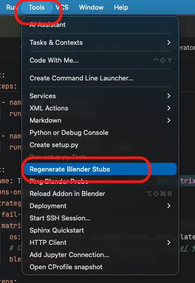

# Generating Code Stubs (Autocompletion)

To enable code completion for `bpy` and other Blender modules:

1.  Open your project in PyCharm.
2.  Go to **Tools** > **Regenerate Blender Stubs**.
3.  Wait for the progress bar to finish. A hidden folder `.blender_stubs` will be created in your project root and automatically marked as a Source Root.



> **💡 Tip:** The `.blender_stubs` folder contains generated files that do not need to be version controlled. It is recommended to add `.blender_stubs/` to your project's `.gitignore` file.
> *(If you created your project using the **Blender Addon** wizard, this is already configured.)*

> **💡 Tip:** Since Blender's API is highly dynamic, PyCharm sometimes cannot infer types automatically (especially for `bpy.context`). To get full autocompletion, use **Type Hinting**:
> ```python
> def my_func(context: bpy.types.Context):
>     obj: bpy.types.Object = context.active_object
>     print(obj.location) # Autocompletion works
> ```

> **💡 Tip:** If the generated stubs don't meet your needs, feel free to delete `.blender_stubs` and opt for static stubs like `fake-bpy-module`. For consistent type checking (mypy/pyright/pyrefly/ty) across different environments or newer Blender versions, you can also include the `.blender_stubs` directory in your git repository.
